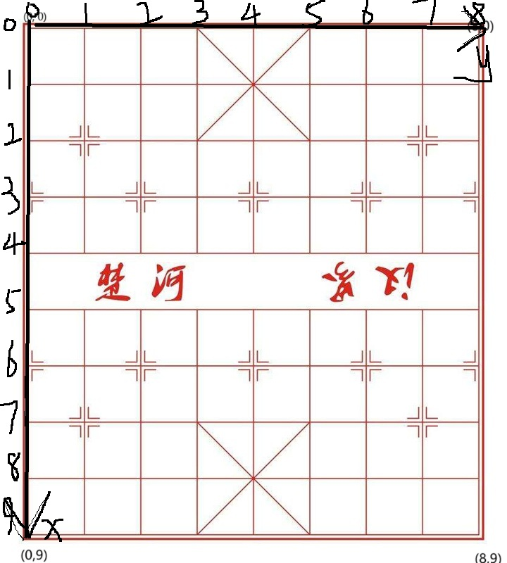

此项目涉及数据库编程、网络编程、swing客户端编程。

服务器设计核心：单一服务器，多个端口

长连接设计 - 服务端：

ServerSocket 监听 请求长连接的 Socket，

建立长连接时，新开一个线程 ClientHandler 去监听该 Socket，

对于这个 Socket 发送的业务，在 ClientHandler 再套一层线程去处理。

发送的请求具体来说：

长连接设计 - 客户端：

在登录时，如果登录成功，也意味着成功建立了长连接。

服务端可能更关注：

- 多个连接的管理（查找、广播等）。
- 连接的安全性（认证等）。
- 资源限制（如每个连接的带宽限制）。

客户端可能更关注：

- 连接中断的重连机制。
- 与服务端的通信协议（请求-响应或推送等）。

- 设计断连和重连的机制
- 设计心跳机制(在典型的客户端-服务器架构中，心跳机制可以由任何一方发起，但常见的做法是客户端发送心跳到服务器)

项目亮点：

UI渲染和游戏逻辑分离

线程池技术

#### 网络编程部分：

中心服务器接受客户端的请求，包括：

- 申请游戏房间

  - 常规移动棋子和吃子，向双方及时更新 GameRoom

  - 申请和棋
  - 申请悔棋

- 账号密码查询
- 挑战大厅
  - 创建挑战(此时不允许参与别人发起的挑战)
  - 参与挑战(包括进入房间和随机匹配)

- 生命周期管理

  - 创建：当两个玩家确认游戏时

  - 运行：持续处理命令直到游戏结束

  - 终止条件：
    a) 游戏正常结束（将死/认输）
    b) 玩家掉线（等待超时后）
    c) 玩家主动退出

---

---

---

#### 游戏客户端部分

- 初始总共32个棋子，分黑方和红方，每方16个。

- 固定黑方在上，红方在下。

- 每方棋子分七类：将(帅)、仕(士)、象(相): 马、车、炮、卒(兵)
- 各类棋子有自己的行走规则，不能超出棋盘范围

如图，8x9 的棋盘，有 9x10 个落脚点。

#### 棋子规则

##### 马：

- 只能走日字
- 有蹩脚规则

##### 兵：

- 如果没过河，只能走直线
- 如果过了河，可以左右移动
- 不能后退

##### 帅：

- 只能在王宫移动

- 只能走直线，每次只能走一格

  

##### 炮：

- 只能走直线
- 移动时，中间不能被其它棋子挡住
- 吃子时，中间要有一个棋子做炮脚

​	

##### 仕：

- 只能在王宫移动
- 只能走斜线

##### 象：

- 只能走田字
- 有蹩脚规则
- 不能过河

##### 车：

- 只能走直线
- 移动的目标点中间不能有棋子，吃子同理

#### 扩展内容

UI自适应

聊天功能

回放功能

观战模式

匹配模式

redis优化

#### 主要思路

MainServer新开线程GameThread

悔棋、求和、认输

#### 重大bug

- 存客户端socket 的 ip 时参数写错了，写成了自己服务器socket的ip
- String 的 == 符号用错了，一个是socket传来的String，一个是自己new的String，这是就算是 "ab" == "ab" 也会返回 false
- 就不能存客户端的socket的ip，而是建立一个长连接